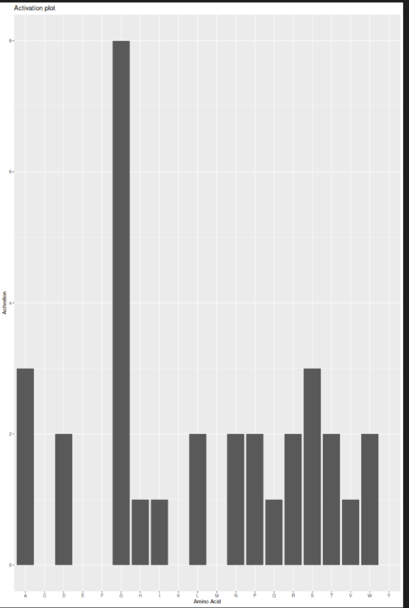

# bioseer

# Description
bioseer is a package which is meant to help the user visualize the outputs of a spare autoencoder (SAE) interpretability study performed on biological sequence models. Looking at the distribution of inputs which activate a given feature can help enhance one's understanding of the underlying architecture that is learned from models trying to approximate the biological sequences they're trained on. This extension builds on the prior work which has been done to actually train sparse autoencoders on both large language models and, more recently, biological sequence models like ESM2.

# Installation
To install the latest version of the package:

```{R}
install.packages("devtools")
library("devtools")
devtools::install_github("davatana/bioseer", build_vignettes = TRUE)
library("bioseer")
```

To run the shiny App: Under construction

# Overview
The existing functionality for the package includes finding all the files which are in the .csv format in the data/ directory which allows you to see the stored data. This data has to be generated outside of the package currently.

The other currently implemented function is one which sums the presence of activations by each amino acid so you can then see how the given feature is generally reacting to each amino acid within the protein.



Other functions to be added are visualization of the protein sequence coming from the example to show the degree of activation for each residue independently over the entire protein or the portion which has significant activation on that feature.

See the vignette called Starter.Rmd for code usage examples for those functions.

```{R}
browseVignettes("bioseer")
```

# Contributions
David Atanasov is the author of bioseer.

The example data found in data is taken from Bai (2024) by drawing from the interprot website where specific sequences are displayed alongside features gleaned from the SAE. The files are named based on the feature as listed from the interprot website suffixed with the protein sequence's AlphaFoldDB entry.

OpenAI's GPT4o model through the ChatGPT interface was used for code development, primarily for fixing bugs such as the relative file path issue I had in the list_csv_files and plot_activations tests. It also assisted with boilerplate generation of some code, whereas the usethis component of the devtools package assisted with generation of files necessary for basic R package functioning.

# References
Liam Bai (2024). Interprot, https://github.com/etowahadams/interprot/tree/main

Wickham H (2016). ggplot2: Elegant Graphics for Data Analysis. Springer-Verlag New York. ISBN 978-3-319-24277-4, https://ggplot2.tidyverse.org.

OpenAI (2024). ChatGPT (November 2023 version), https://chat.openai.com/.

Wickham H, Hester J, Chang W, Bryan J (2024). devtools: Tools to Make Developing R Packages Easier. R package version 2.4.5.9000, , https://github.com/r-lib/devtools.

# Acknowledgements
This package was developed as part of an assessment for 2024 BCB410H: Applied Bioinformatics course at the University of Toronto, CANADA. bioseer welcomes issues, enhancement requesets, and other contributions. To submit an issue, use the GitHub issues.
